nom, adresse MAC et adresse IP de l'interface WiFI:

PS C:\Users\Laurent> ipconfig /all

nom : Carte réseau sans fil Wi-Fi

adresse MAC : Adresse physique . . . . . . . . . . . : 40-74-E0-DF-DC-57

adresse IP : Adresse IPv4. . . . . . . . . . . . . .: 10.33.0.221(préféré)

J'AI PAS ETHERNET SORRY

Utilisez une commande pour connaître l'adresse IP de la passerelle de votre carte WiFi:
Passerelle par défaut. . . . . . . . . : 10.33.3.253

Trouvez l'IP, la MAC et la gateway pour l'interface WiFi de votre PC : right click sur l'icone wifi -> ouvrir les paramètres réseau et internet -> modifier les options d'adaptateurs -> click droit sur le wifi -> status -> détails ->et on regarder les informations
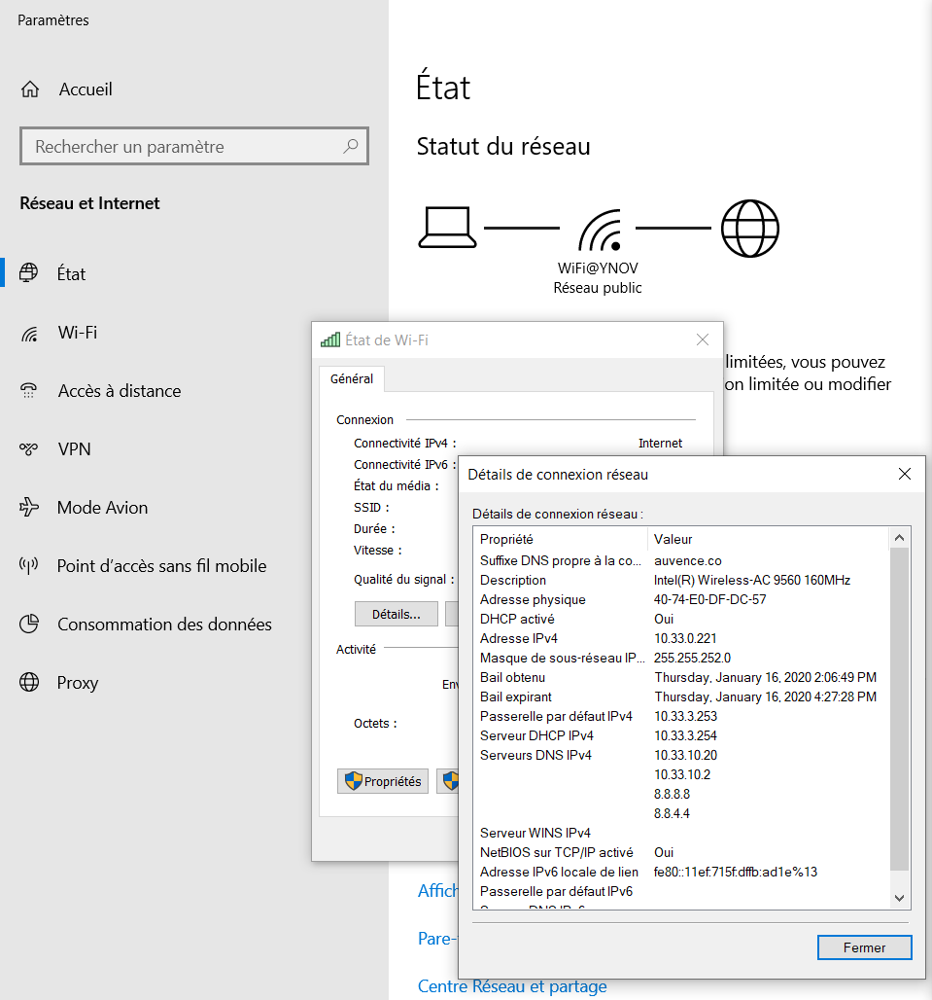

A quoi sert la gateway dans le réseau d'YNOV ? : Elle nous sert de plateforme pour accéder à un autre réseau, ou internet.

Changement d'adresse ip avec une intarface
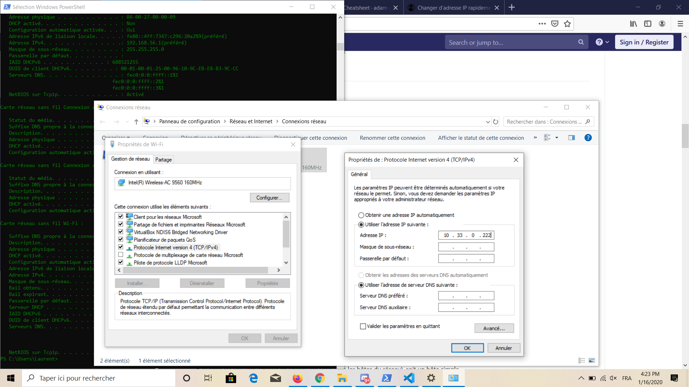

J'ai perdu internet car l'adresse ip que j'ai rentrée était déjà prise.

nmap :
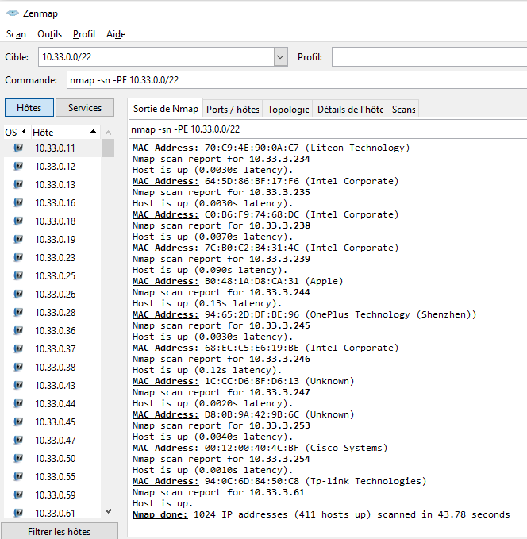
Modification d'adresse IP (part 2)
Exploration locale en duo
Parametre carte ethernet :
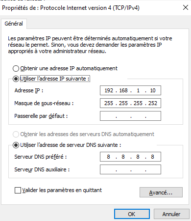
Test de la connexion :
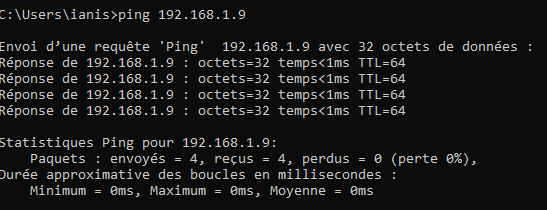
Utilisation d'un des deux comme gateway
sur le PC qui n'a plus internet
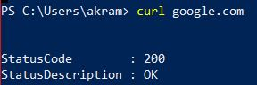
sur le PC qui a toujours internet
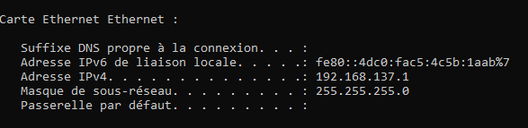
Petit chat privé
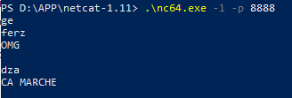
Wireshark
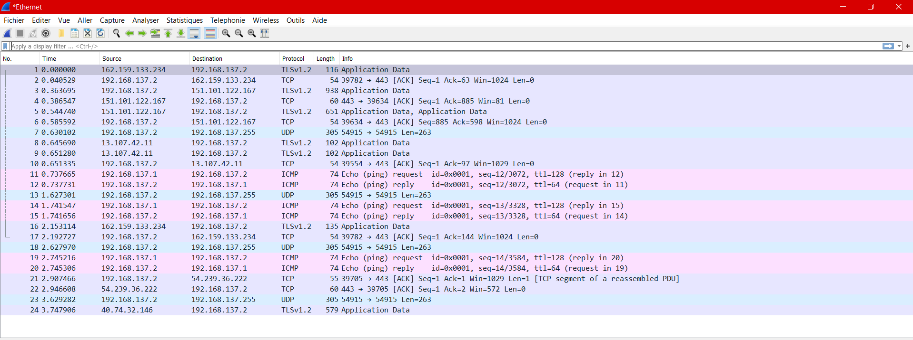
Firewall

Manipulations d'autres outils/protocoles côté client
DHCP
afficher l'adresse IP du serveur DHCP du réseau WiFi YNOV:
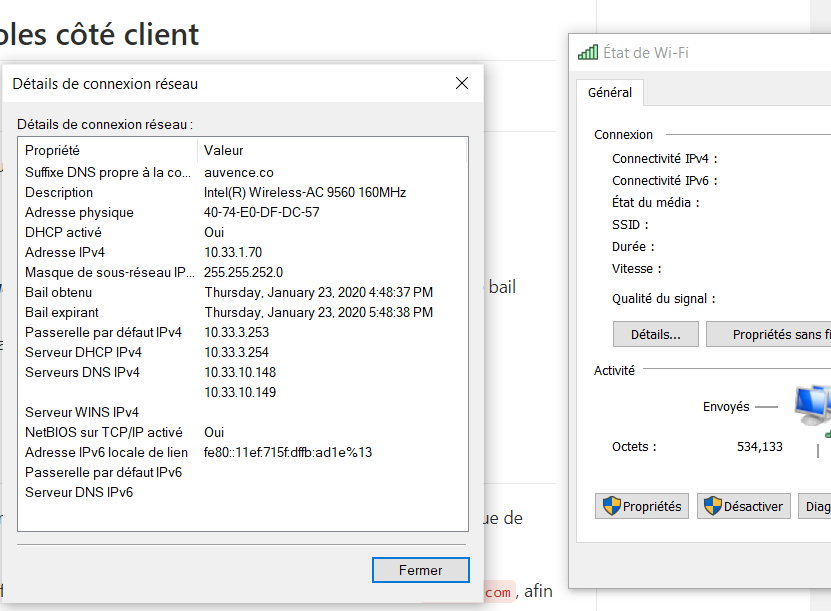
Trouver la date d'expiration de votre bail DHCP
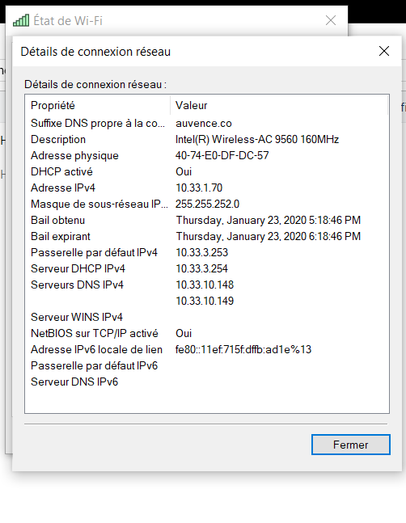
demandez une nouvelle adresse IP (en ligne de commande)
ipconfig /release
ipconfig /renew

DNS
trouver l'adresse IP du serveur DNS que connaît votre ordinateur
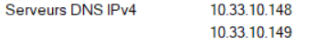

utiliser, en ligne de commande l'outil nslookup (Windows, MacOS) ou dig (GNU/Linux, MacOS) pour faire des requêtes DNS à la main
faites un lookup (lookup = "dis moi à quelle IP se trouve tel nom de domaine")
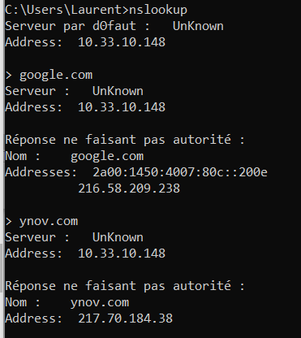

faites un reverse lookup
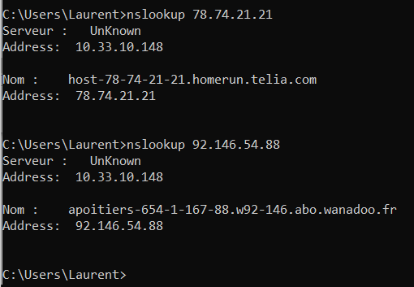
